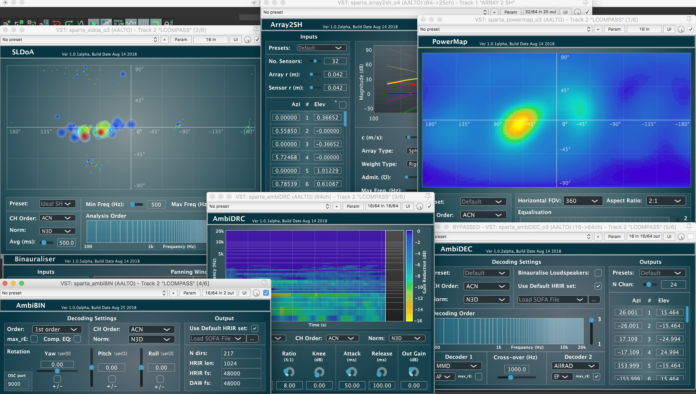

# SPARTA

Spatial Audio Real-Time Applications (SPARTA) [1]. A collection of VST/LV2 audio plug-ins for spatial audio production, reproduction and visualisation. Developed using [JUCE](https://github.com/WeAreROLI/JUCE/) and the [Spatial_Audio_Framework](https://github.com/leomccormack/Spatial_Audio_Framework).



* [1] McCormack, L. and Politis, A. 2019. [**SPARTA & COMPASS: Real-time implementations of linear and parametric spatial audio reproduction and processing methods**](docs/McCormackPolitis2019SpartaCompass.pdf). In Audio Engineering Society Conference: 2019 AES International Conference on Immersive and Interactive Audio.

## Plug-in descriptions

This repository contains the following audio plug-ins:
* **AmbiBIN** - A binaural Ambisonic decoder (up to 10th order) with a built-in SOFA loader and head-tracking support via OSC messages. Includes: Least-Squares (LS), spatial re-sampling (SPR), time-alignment (TA), and magnitude least-squares (Mag-LS) decoding options.
* **AmbiDEC** - A frequency-dependent loudspeaker Ambisonic decoder (up to 10th order) with user specifiable loudspeaker directions (up to 128), which may be optionally imported via JSON configuration files. Includes: All-Round (AllRAD), Energy-Preserving (EPAD), Spatial (SAD), and Mode-Matching (MMD) Ambisonic decoding options. The loudspeaker signals may also be binauralised for headphone playback.
* **AmbiDRC** - A frequency-dependent dynamic range compressor for ambisonic signals (up to 10th order). 
* **AmbiENC** - An Ambisonic encoder/panner (up to 10th order), with support for up to 128 input channels; the directions for which may also be imported via JSON configuration files. 
* **AmbiRoomSim** - An Ambisonic encoder that also includes room reflections based on the image-source method using a shoebox room model. Multiple sources and multiple receivers are supported up to 128 channels (e.g. 32x 1st-order, 8x 3rd-order, or 2x 7th order receivers).
* **Array2SH** - A microphone array spatial encoder (up to 10th order), with presets for several commercially available A-format and higher-order microphone arrays. The plug-in can also present objective evaluation metrics for the currently selected configuration.
* **Beamformer** - A spherical harmonic domain beamforming plug-in with multiple beamforming strategies (up to 128 output beams).  
* **Binauraliser** - A binaural panner (up to 128 input channels) with a built-in SOFA loader and head-tracking support via OSC messages.
* **BinauraliserNF** - Binauraliser, with the addition of proximity filtering for near field sound sources.
* **DirASS** - A sound-field visualiser based on re-assigning the energy of beamformers. This re-assignment is based on DoA estimates extracted from "spatially-constrained" regions, which are centred around each beamformer look-direction. 
* **MatrixConv** - A basic matrix convolver with an optional partitioned convolution mode. The user need only specify the number of inputs and load the filters via a wav file.
* **MultiConv** - A basic multi-channel convolver with an optional partitioned convolution mode. Unlike "MatrixConv", this plug-in does not perform any matrixing. Instead, each input channel is convolved with the respective filter; i.e. numInputs = numFilters = numOutputs.
* **6DoFconv** - A time-varying partitioned convolution multi-channel convolver for SOFA files containing RIRs with multiple listener positions.
* **Panner** - A frequency-dependent 3-D panner using the VBAP method (up to 128 inputs and outputs).
* **PitchShifter** - A very basic multi-channel pitch shifter, based on the phase-vocoder approach.
* **PowerMap** - A sound-field visualisation plug-in based on Ambisonic signals as input (up to 10th order), with PWD/MVDR/MUSIC/Min-Norm options.
* **Rotator** - A flexible Ambisonic rotator (up to 10th order) with head-tracking support via OSC messages. 
* **SLDoA** - A frequency-dependent sound-field visualiser (up to 10th order), based on depicting the direction-of-arrival (DoA) estimates derived from spatially localised active-intensity vectors. The low frequency estimates are shown with blue icons, mid-frequencies with green, and high-frequencies with red. 
* **Spreader** - An arbitrary array (HRIRs, microphone array IRs, etc.) encoder with coherent and incoherent spreading modes.
* **TrackerTest** - A tool for outputting incoming headtracker data as audio signals.

## Pre-built plug-ins

[]()

[The plug-in suite may be downloaded from here](https://github.com/leomccormack/SPARTA/releases/latest) [Mac OSX (10.10 or higher), Linux (x86_64), and Windows (x86_64)].

## Building the plug-ins yourself

First clone the repository (including submodules) with:

```
git clone --recursive https://github.com/leomccormack/SPARTA
# or if you have already cloned the repository, update/init with:
git submodule update --init --recursive
```

## Prerequisites 

The [VST2_SDK](https://web.archive.org/web/20181016150224/https://download.steinberg.net/sdk_downloads/vstsdk3610_11_06_2018_build_37.zip) should be placed in the 'SDKs' folder like so:
```
SDKs/VST2_SDK
```

By default, **MacOSX, Linux and Windows (x86_64/amd64)** users need to install [Intel oneAPI](https://www.intel.com/content/www/us/en/developer/tools/oneapi/base-toolkit-download.html) (MKL and IPP) and run the **install-safmkl**.sh/.bat and **install-safipp**.sh/.bat scripts found in SDKs/Spatial_Audio_Framework/scripts. Whereas, **Raspberry Pi (ARM)** users instead require OpenBLAS and LAPACKE libraries:
``` 
sudo apt-get install liblapack3 liblapack-dev libopenblas-base libopenblas-dev liblapacke-dev
```
Note, however, that alternative performance libraries may also be used, with more information provided [here](https://github.com/leomccormack/Spatial_Audio_Framework/blob/master/docs/PERFORMANCE_LIBRARY_INSTRUCTIONS.md).

**Linux (x86_64/amd64 and ARM)** users must also install the following libraries required by JUCE:

```
sudo apt-get install x11proto-xinerama-dev libwebkit2gtk-4.0-dev libgtk-3-dev x11proto-xext-dev libcurl4-openssl-dev libasound2-dev
```

## Building the plug-ins via CMake 

The plug-ins may be built with CMake (version 3.15 or higher):
 ```
 mkdir build
 cmake -S . -B build -DSAF_ENABLE_SOFA_READER_MODULE=1 
 cd build
 make
 ```
 
Or for Visual Studio 2022 users (using x64 Native Tools Command Prompt as **administrator**; and also e.g., building LV2 and VST3 versions):
```
cmake -S . -B build -G "Visual Studio 17" -DSAF_ENABLE_SOFA_READER_MODULE=1 -DBUILD_PLUGIN_FORMAT_LV2=1 -DBUILD_PLUGIN_FORMAT_VST3=1
cd build
msbuild ALL_BUILD.vcxproj /p:Configuration=Release /m
```

## Building the plug-ins via the included scripts

**MacOSX/Linux users** may run the following bash script via the Terminal to build all of the plugins:

```
./build-plugins.sh all
# Note: MacOSX users may need to first install and enable Xcode Command Line Tools:
xcode-select --install 
sudo xcode-select -s /Applications/Xcode.app/Contents/Developer 
```

**Windows users** may instead run the following batch script via the "x64 Developer Command Prompt for VS.exe":

```
build-plugins.bat <path/to/Projucer.exe>
```

### Additional scripts and options for MacOSX/Linux users

The repository also includes the following install scripts:
```
./install-juce.sh      # builds a GPLv3 version of the Projucer App and copies it into "SDKs"
./install-vst2_sdk.sh  # downloads, unzips, and places the VST2_SDK into "SDKs"
```

The build.plugins.sh script also supports many additional options:
```
./build-plugins.sh --help    # help information
./build-plugins.sh projuce   # generates Linux makefiles and IDE project files for all plugins
./build-plugins.sh clean     # cleans all plugins 
./build-plugins.sh build     # builds all plugins
./build-plugins.sh all       # projuces, cleans, and then builds all plugins
./build-plugins.sh _SPARTA_ambiBIN_ all       # projuces+cleans+builds sparta_ambiBIN.vst
./build-plugins.sh _SPARTA_ambiENC_ build     # builds "sparta_ambiENC.vst"
./build-plugins.sh _SPARTA_array2sh_ projucer # opens "sparta_array2sh.jucer" with Projucer
```

## Building the plug-ins without scripts or CMake

You may also manually open each .jucer file with the Projucer App and click "Save Project". This will generate Visual Studio (2017) solution files, Xcode project files, Linux Makefiles (amd64), and Raspberry Pi Linux Makefiles (ARM), which are placed in:

```
audio_plugins/_SPARTA_X_/make/
```

To generate project files for other IDEs, you may open and configure the included .jucer files accordingly.

## Contributing

Suggestions and contributions to the code are both welcomed and encouraged. Feel free to branch off and submit pull requests. If the changes/additions are major, then consider first discussing it via a github "issue" thread.

## Contributors 

* **Leo McCormack** - C/C++ programmer and algorithm design
* **Symeon Delikaris-Manias** - algorithm design
* **Archontis Politis** -  algorithm design
* **Ville Pulkki** - algorithm design
* **Marc Lavallée** - bash scripter

## License

This project is provided under the GPLv3 License - see the [LICENSE](LICENSE) file for details. 
